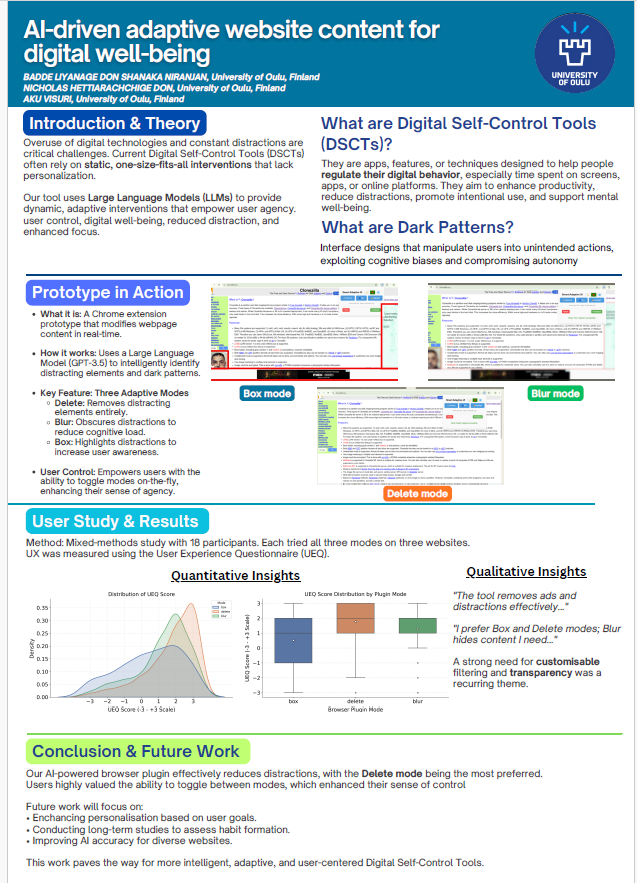
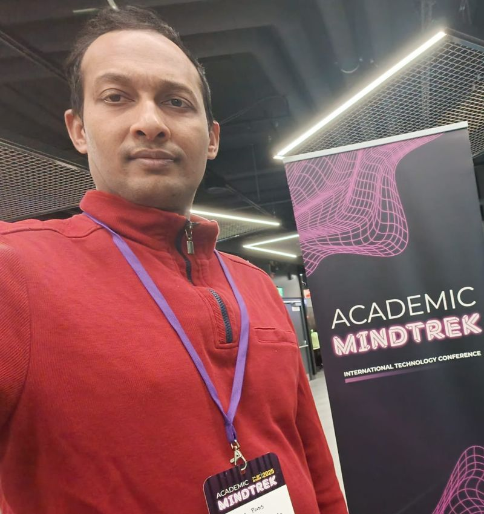
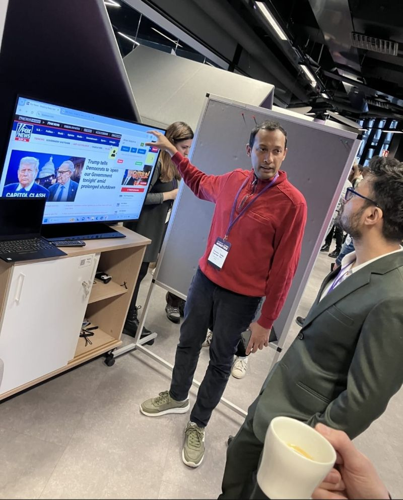
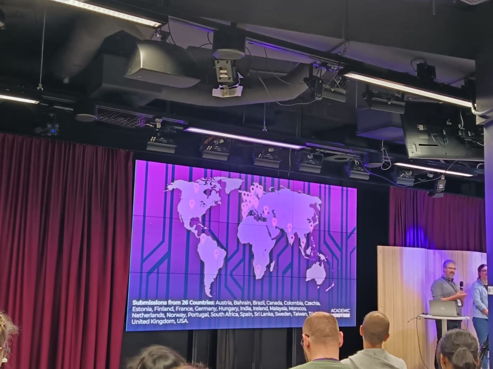
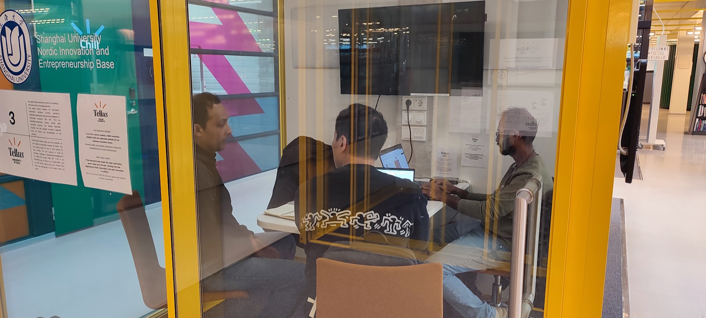

**Smart Adaptive Interfaces** is a research-driven browser extension that leverages **Large Language Models (LLMs)** to dynamically modify web content for improved digital wellbeing. This project, team based one that I have worked with Nicholas and supervised by Dr Aku visuri.

The project addresses the overuse of digital technologies by implementing three adaptive interaction modes that allow users to **suppress, obscure, or highlight** web elements based on AI-identified distractions and dark patterns. Our mixed-methods study with 18 participants demonstrated that users preferred the **suppress mode** and valued the ability to toggle between modes, enhancing their sense of control over digital distractions.

## 🗂️ Research Artifacts

Below are the key artifacts from this project - conference presentation, research poster, PoC demo video, user study snapshots, and the ACM publication.

---

## 📸 Academic MindTrek 2025 — Tampere, Finland

  
  
  
  
  

  
---

## 🎬 Demo Video

*PoC demonstration of the three adaptive modes - suppress, obscure, and highlight in action.*

<video controls width="100%" style="border-radius: 8px;">
  <source src="demo-video.mp4" type="video/mp4">
  Your browser does not support the video tag.
</video>

---

## 📄 Publication


**Published at ACM MindTrek 2025, Tampere, Finland**
Niranjan Badde Liyanage Don, S., Hettiarachchige Don, N., & Visuri, A. (2025). AI-driven adaptive website content for digital well-being. *Proceedings of the 28th International Academic Mindtrek*, pp. 449–453.
👉 [Read the paper →](https://dl.acm.org/doi/10.1145/3757980.3762111)


---

## 🙏 Acknowledgements

This project would not have been possible without the support and guidance of:

<ul class="not-prose list-none pl-0 space-y-2 text-left">
  <li>🔹 <strong><a href="https://www.oulu.fi/en/researchers/timo-ojala" target="_blank">Professor Timo Ojala</a></strong> : Professor of Computer Science, Director of ITEE, University of Oulu- for his continued support, guidance, and encouragement throughout my academic journey at the University of Oulu</li>
  <li>🔹 <strong><a href="https://ubicomp.oulu.fi/staff-members/aku-visuri/" target="_blank">Dr. Aku Visuri</a></strong> : Postdoctoral Researcher, Supervisor research collaborator, UBICOMP Research Unit, University of Oulu - for his invaluable supervision, feedback, and mentorship throughout the research and publication process</li>
  <li>🔹 <strong><a href="https://www.researchgate.net/profile/Nicholas-Hettiarachchige-Don" target="_blank">Nicholas Ruchira Shehan Hettiarachchige Don</a></strong> : Co-author and research collaborator — for his contributions to the analysis of the user study data</li>
</ul>

---

👉 [View Full Project →](/projects/academic/smartadaptiveinterfaces/)
