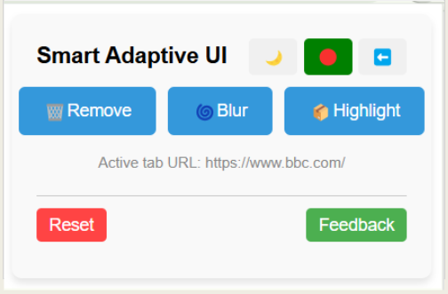
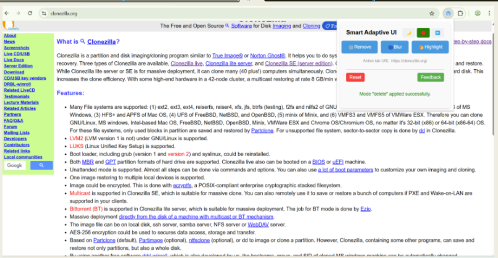
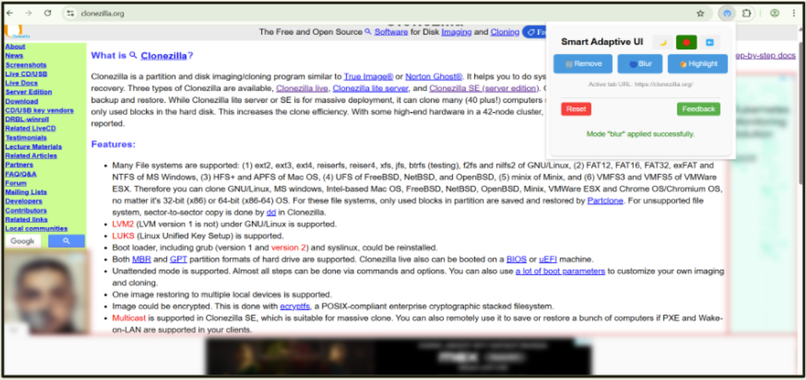
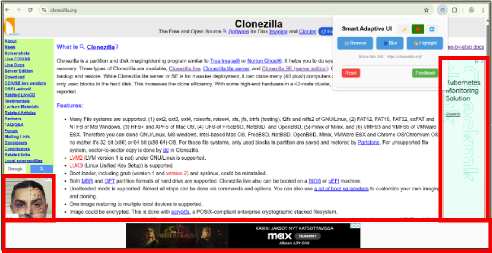
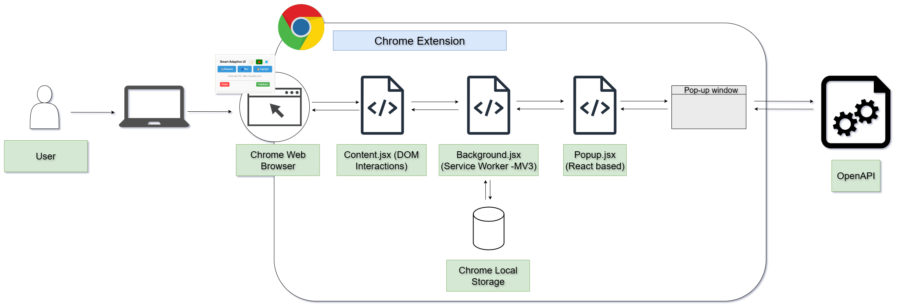
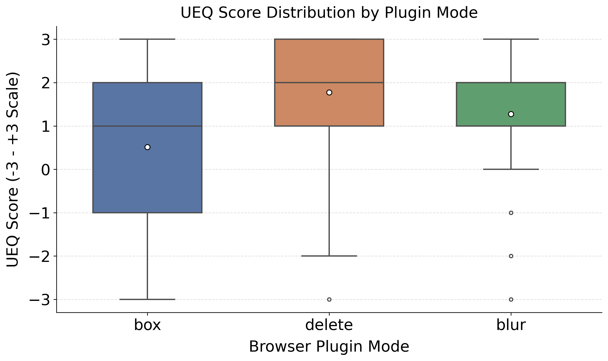
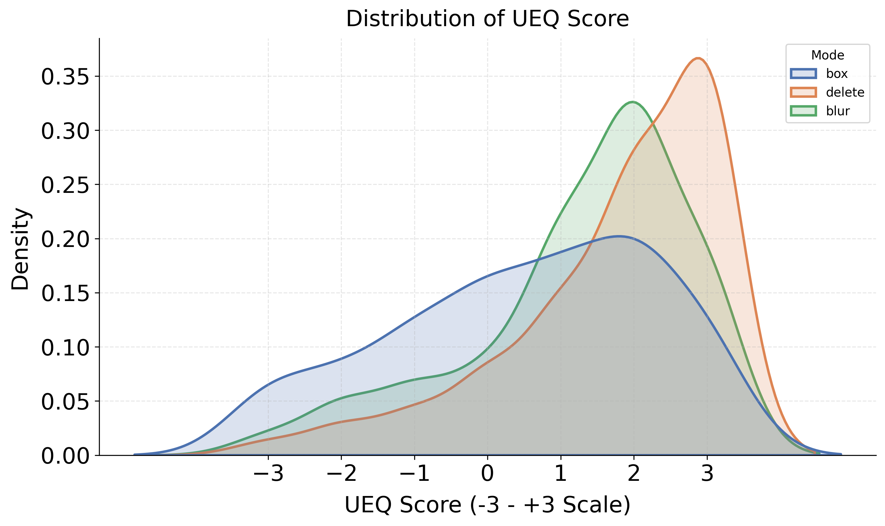

## Project Overview

**Research Unit:** University of Oulu, UBICOMP  
**Timeline:** Nov 2024 – May 2025  
**Type:** Academic Research / Progressive Web Software - A browser-based extension tool 
**View app:** [SmartAdaptiveUi](https://vm1297.kaj.pouta.csc.fi/)


**Smart Adaptive Interfaces** is a research-driven browser extension that leverages **Large Language Models (LLMs)** to dynamically modify web content for improved digital wellbeing.  

The project addresses the overuse of digital technologies by implementing three adaptive interaction modes that allow users to **suppress, obscure, or highlight** web elements based on AI-identified distractions and dark patterns. Our mixed-methods study with 18 participants demonstrated that users preferred the **suppress mode** and valued the ability to toggle between modes, enhancing their sense of control over digital distractions.

This project began as a developing a prototype to explore how **AI can improve users' digital lives** by creating a functional system evaluated through a user study. The project was selected at **Academic MindTrek 2025** in Tampere, Finland, recognizing its contribution to intelligent, adaptive Digital Self-Control Tools (DSCTs).

---

## Key Features

* **Suppress (Delete Mode)** – Removes distractions or irrelevant elements for a clean, minimal focused browsing experience.
* **Obscure Mode (Blur Mode)** – Obscures distracting elements while maintaining page layout and context.
* **Highlight Mode (Box Mode)** – Visually emphasizes distractions using bounding boxes for attention management.
* **Dynamic Toggling** – Seamless switching between modes during browsing sessions.

---

## Research Purpose
The primary research goal was to investigate:  
- How **AI-driven content modification** influences user **focus, productivity, and cognitive load** across different website types.
- How **real-time LLM processing** can be effectively integrated into **browser environments** for immediate user benefit.
- How users **navigate and prefer** between different levels of content intervention (removal, obscuring, highlighting) based on context and task requirements.

---

## System Architecture
The SmartAdaptiveUI browser extension is implemented with React and JavaScript ES6 modules, built on the Chrome Extensions API and OpenAI API. Its modular design separates functionality across three layers:

- **Popup UI** – main interface to facilitate interactions between the user interface and web
pages and providing the functionalities.

- **Background** logic – manages API calls, processes user actions, and coordinates extension events.

- **Content scripts (DOM interaction layer)-** – dynamically filter, modify, or highlight webpage elements based on AI outputs.

The system communicates directly with OpenAI’s GPT-3.5 for content analysis and intervention decisions, eliminating the need for a dedicated backend server. This reduces latency, simplifies deployment, and improves responsiveness.

The architecture (Figure 2) illustrates the flow between user interactions, the extension modules, and the LLM-powered adaptive interventions that enable Delete, Obscure, and Highlight modes.

---

## Study Methodology
We conducted a mixed-methods user study with 18 participants (mean age = 26.4, SD = 4.2; 15 male, 3 female) recruited via our university’s [SONA](https://oulu-ubicomp.sona-systems.com/) platform, and complemented with Google Forms surveys. Collected data was analyzed in a structured manner. After a pilot, the main study followed this flow:

- **Baseline:-** Participants first browsed unmodified websites (one self-chosen, two researcher-provided: clonezilla.org and bbc.com).

- **Plugin interaction:-** Each participant used the three modes — Delete, Blur, and Highlight/Box across three websites per mode (2 researcher-selected + 1 participant-selected), totaling 9 sessions.

- **Randomization:-** Mode order was balanced with a Latin Square design to minimize order effects.

- **Evaluation:-** After each mode, participants completed the UEQ-L (User Experience Questionnaire, long version), capturing both pragmatic (clarity, efficiency) and hedonic (stimulation, originality) qualities.
 
- **Wrap-up:-** A final questionnaire and think-aloud interviews captured overall impressions and behavioral observations while the system being used.

---

## Ovrall Analysis

**Quantitative:** Kruskal–Wallis tests showed significant differences between modes (*p < 0.05*). **Delete mode** scored highest in user experience.  

**Qualitative:**  
- **Suppress/Delete** → most effective for removing distractions and enhancing focus.  
- **Obscure/Blur** → useful, but sometimes hid relevant content and created clutter.  
- **Highlight/Box** → mixed reactions; helpful for marking ads but occasionally flagged irrelevant items.  
- **Toggling features** were highly valued, giving users flexible, real-time control.  

Emerging themes highlighted the need for **customizable filtering**, **transparency in AI decisions**, and **context-aware interventions** that adapt to specific tasks and sites. Participants emphasized that real-time control supported **greater focus and mindful browsing**.  

## Limitations and Challenges  

Our study faced several limitations. The sample size was small (n=18) and skewed toward digitally literate university students, which may reduce generalizability. The controlled environment may not fully reflect natural browsing behaviors. Technical constraints included OpenAI token limits restricting page content size, difficulties with infinite scroll and dynamic loading, and limited adaptability for non-English sites. Interaction times were also short, leaving longer-term use effects unexplored.  

Key challenges arose in ensuring real-time adaptability across diverse website structures. Mapping distractions and dark patterns without breaking site functionality was complex, often leading to false positives. Minor bugs and DOM inconsistencies highlighted the need for continued refinement.  

## Future Work  

Future work will explore:  
- **Personalization** of distraction filtering and adaptive interventions.  
- **Support for multilingual and non-English sites** to increase accessibility.  
- **Extended longitudinal studies** to capture long-term effects, user fatigue, and sustained behavior change.  
- **Improved technical resilience**, including handling infinite scroll, complex DOMs, and reducing false positives.  

## Academic Contribution  

This work advances research on **Digital Self-Control Tools (DSCTs)** by introducing an **AI-powered, adaptive browser extension** that moves beyond static blocking. Our contribution lies in:  
- Demonstrating **three distinct interaction modes** (Delete, Blur, Highlight/Box) for user-driven customization.  
- Integrating **LLM-based detection** with real-time, user-controlled interventions.  
- Providing empirical evidence from a **mixed-methods user study** on how adaptive interfaces affect perceived control, usability, and digital well-being.  

---
## Technologies Used  
`React` · `JavaScript (ES6 Modules)` · `Chrome Extensions API` · `OpenAI (GPT-3.5)` · `Content Scripts / DOM Manipulation` · `HTML5` · `CSS3`  

---

## Conclusion  

Smart Adaptive Interfaces demonstrate how **LLM-powered adaptive tools** can give users granular control over web distractions in real time. While Delete mode emerged as the most effective, all modes highlighted trade-offs between clarity, flexibility, and usability. Despite technical and methodological limitations, the study shows the potential of adaptive AI systems to enhance **focus, self-regulation, and mindful browsing**. This prototype paves the way for **personalized, context-aware DSCTs** that can scale beyond controlled settings and into everyday digital life.  
