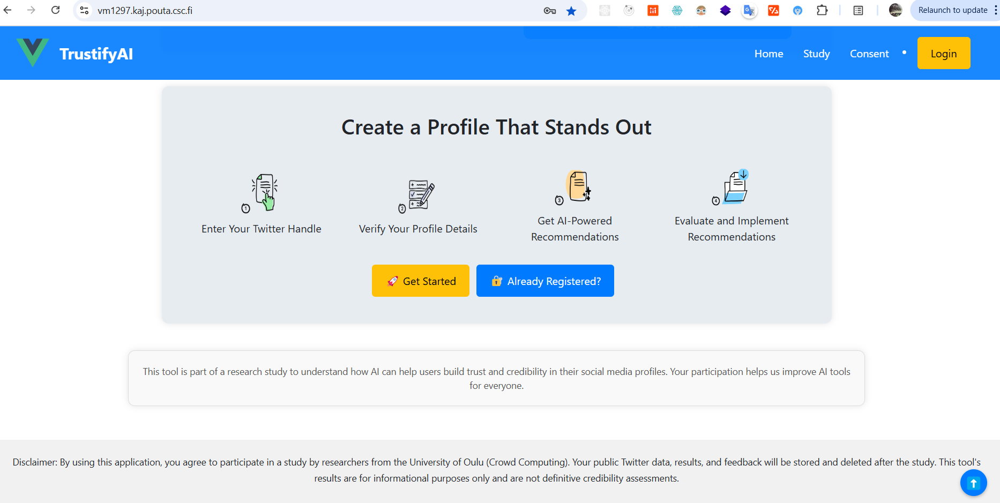
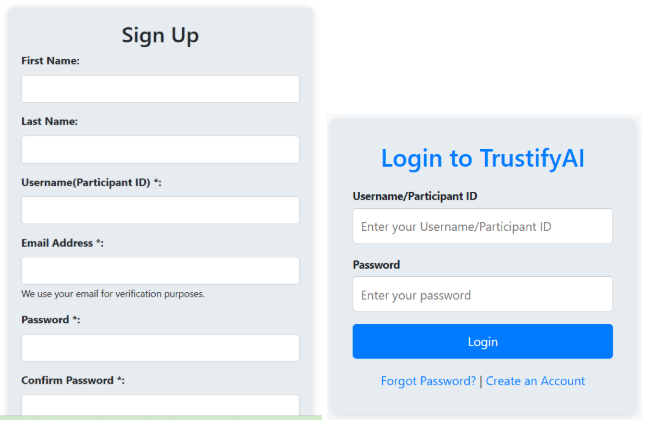
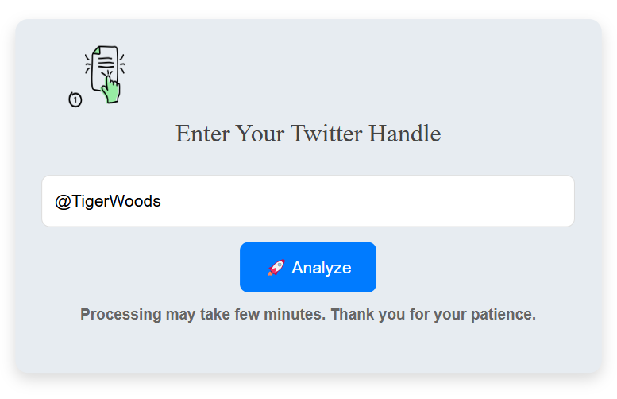
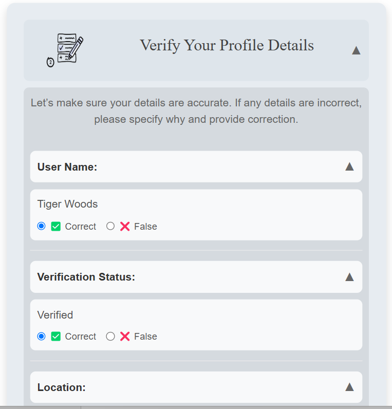
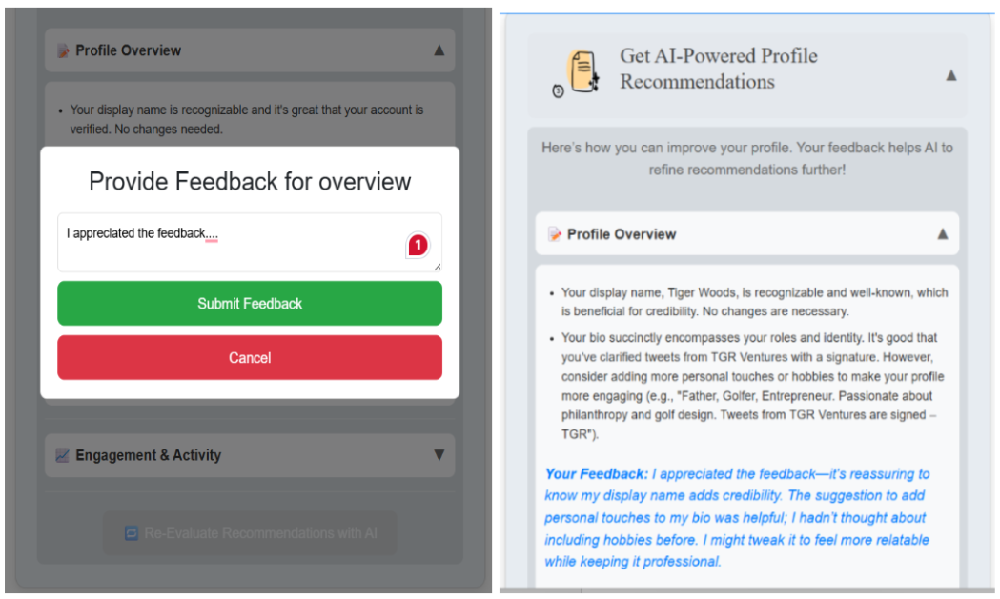
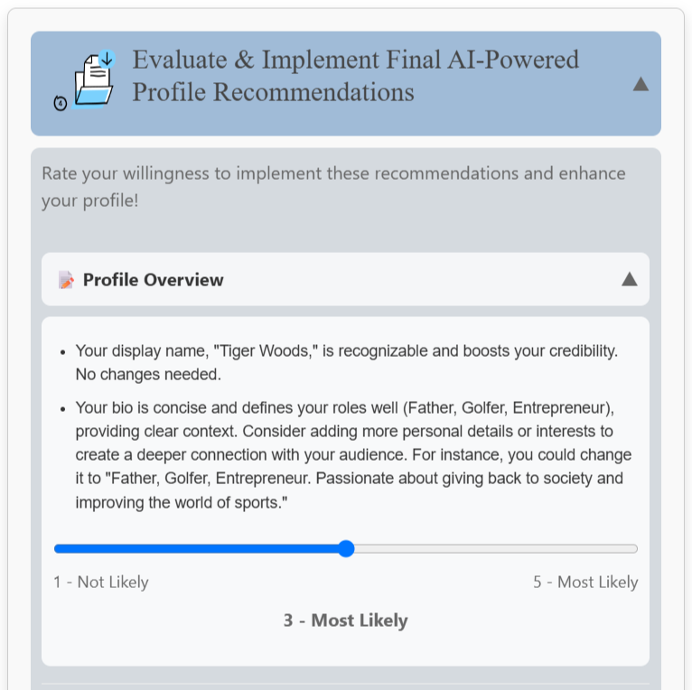
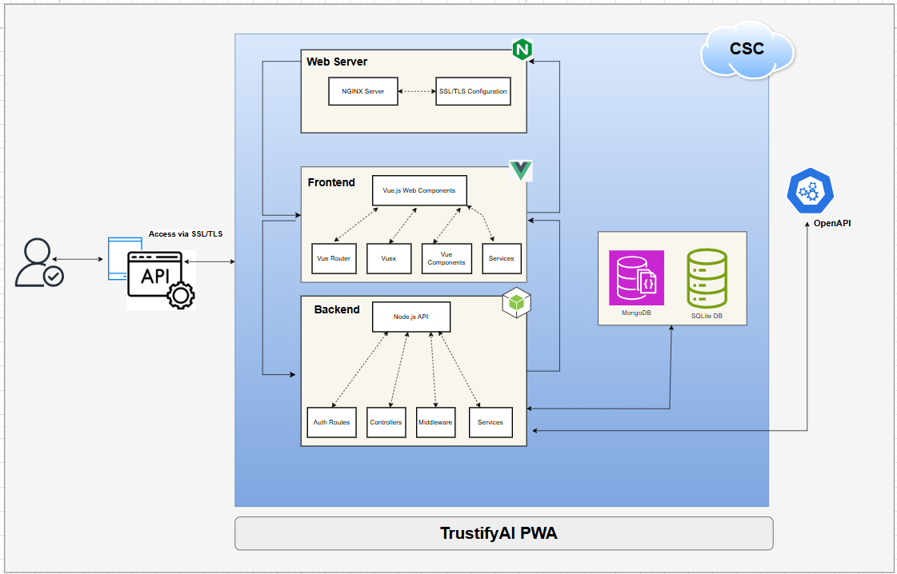
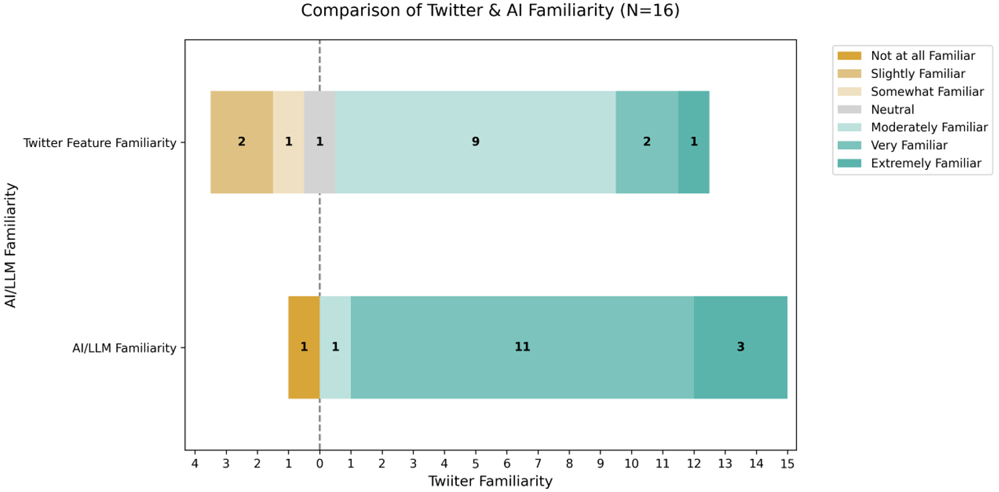
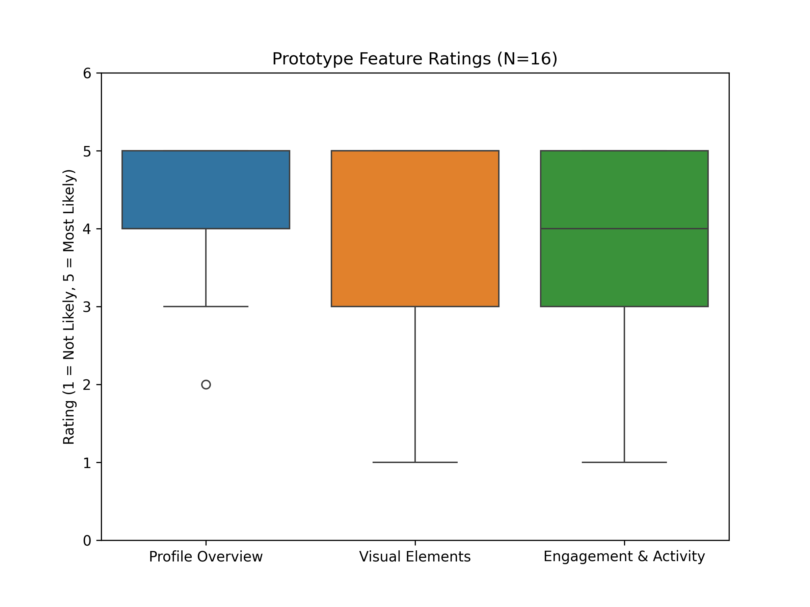
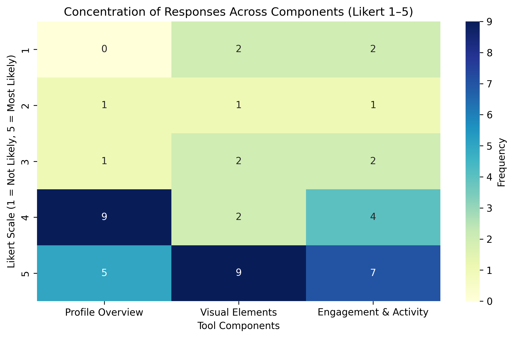

## Project Overview


**Project:** TrustifyAI – Sociam Media(Twitter) Profile Credibility Analyzer  
**Research Unit:** CrowdComputing Research Group, UBICOMP, University of Oulu  
**Timeline:** Nov 2024 – May 2025  
**Type:** MSc Thesis - Academic Research / Progressive Web App 

**View app:** [TrustifyAI](https://vm1297.kaj.pouta.csc.fi/)  
**API Dashboard:** [TrustifyAI](https://vm1297.kaj.pouta.csc.fi/api)


**TrustifyAI**   is an AI-powered Progressive Web App (PWA) designed to evaluate and enhance the credibility of Twitter/X profiles. It integrates Large Language Models (LLMs) with Human-Computer Interaction (HCI) methods to empirically study how users perceive, trust, and adopt AI-generated credibility recommendations.

Developed as the primary artefact for an **Empirical Software Engineering** research study  the system was designed, built, and rigorously evaluated following established SE research methodology, applying the **TAM3 (Technology Acceptance Model)** framework to measure user trust, usability, and adoption intent.

The study culminated in a **16-participant mixed-methods user study**, producing both quantitative metrics and qualitative insights into AI-mediated trust and credibility perception in social media contexts.

---

## Key Features
* **User Guidance Support pages** – Provides the functional workflow, research and other related user study details such as purpose, data privacy and consent policies etc.

* **Registration & User Sign-in/out pages** – Supports user session, personalization and activity tracking with minimal data retention.

* **Profile Data Retrieval** – Accept a Twitter handle (e.g., @username) and fetch publicly available profile data, including credibility-related attributes.

* **Profile Verification** – Review and confirm the retrieved data or flag any discrepancies, ensuring transparency before AI analysis.

* **AI-Powered Recommendations** – The system leverages LLMs to generate tailored suggestions across three categories: Profile Overview, Visual Elements, and Engagement & Activity.

* **User Feedback & Action** – Users can rate the usefulness of recommendations and selectively apply changes to improve profile credibility.

---

## Research Purpose
The primary research goal was to investigate:  

- How **Perceived Ease of Use (PEOU)**, **Perceived Usefulness (PU)**, and **Behavioral Intention (BI)** affect user **trust** in AI-driven recommendations.  
- How credibility cues in social media profiles can be made more **transparent and actionable** with AI assistance.  
- How TAM3 (Technology Acceptance Model 3) applies to evaluating modern **AI-HCI systems**.

---

## LLM Experimentation & Technical Exploration

During the thesis research & technical phases, several LLM frameworks and tools were evaluated to identify the most suitable approach for AI-driven credibility analysis:

- Explored **RAG pipelines** using **LangChain** for context-aware profile evaluation, assessing whether retrieval-augmented approaches could improve recommendation accuracy over direct prompting
- Evaluated **ChromaDB** as a vector database for storing and retrieving profile embeddings
- Experimented with **open-source models** via **Ollama** and **Hugging Face** as alternatives to proprietary APIs, comparing response quality for credibility evaluation tasks with minimal samples
- Studied briefly **LangGraph** for agentic multi-step reasoning workflows - exploring whether agent-based architectures could produce more structured credibility reports

Considering timelines, efforts and scope, Finally seleted **OpenAI GPT-4** via direct API integration, informed by comparative evaluation of the above approaches

This experimentation phase contributed empirical insights into practical trade-offs between different LLM approaches given their rapid progressive support for trust and credibility evaluation in real-world HCI contexts.

---
## System Architecture
The TrustifyAI system was designed with a modular architecture to ensure usability,
flexibility, and ease of development. Each component is separated by functionality
to allow for clearer responsibility and independent upgrades. The overall architecture
comprises four main layers
- **Frontend:** A Vue.js–based interface that supports profile input and user feedback.
- **Backend:** Node.js based RESTful API services for profile data retrieval, processing, and communication with other layers.
- **Database:** 
	*SQLite* manages core user-level operations, including authentication credentials and session tracking.
	*MongoDB* stores participant feedback and interaction data.
- **AI Layer:** LLM integration for generating tailored recommendations  

---

## Study Methodology

A user study was conducted to evaluate how participants engaged with the developed tool. The study was hosted on the research platform [SONA](https://oulu-ubicomp.sona-systems.com/), and complemented with Google Forms surveys. Collected data was analyzed in a structured manner.
- **Pre-Study Survey:** Captured demographics, Twitter usage, and expectations of users 
  The figure above shows participants’ comparative familiarity with Twitter features and AI/LLMs.

 The figure above illustrates overall user appreciation for the AI-generated recommendations.

 above shows the concentration of Likert-scale responses
(1 to 5) across three evaluation components: Profile Overview, Visual Elements,
and Engagement & Activity

- **Think-Aloud Sessions:** Observed and recorded participants interaction while using the system  
- **Post-Study Survey:** Evaluated the collected data for usability, trust, and many other adoption metrics.  
- **In-App Feedback:** Gathered real-time user comments, and feedback directly within the system.  

---

## Ovrall Analysis
- High **usability scores** – participants found the interface intuitive  
- Recommendations rated as **relevant and actionable**  
- **Trust** emerged not just as an outcome but as a **distinct construct**  
- Qualitative feedback showed:
  - Encouraged **self-reflection** on online credibility  
  - Increased **awareness of digital identity cues**  
  - Desire for **personalization, transparency, and platform flexibility**  

---

## Perceived Role in Reducing Misinformation  
Participants saw **TrustifyAI** as a helpful tool for promoting more credible and transparent online identities. By encouraging clearer, verifiable profile information, it supported authenticity and accountability on social media. While its direct effect on systemic misinformation was limited, users viewed it as a **small but positive step** toward a more trustworthy digital environment.  

---

## Limitations and Challenges  
Despite the promising outcomes, the project also revealed certain limitations that highlight opportunities for further improvement:

- Recommendations were sometimes **generic** due to limited personalisation from limited Twitter content analysis,  
- The tool’s **Twitter-only focus** restricted cross-platform credibility support.  
- Lack of **multimodal analysis** (e.g., images) weakened identity representation.  
- Evaluation was short-term and involved a **small, homogeneous sample**, limiting generalisability
- Users expressed cautious trust in AI’s ethical judgment, highlighting a need for **greater transparency and explainability**.  
- LLM experimentation revealed trade-offs between **open-source models** (Ollama, Hugging Face) and proprietary APIs (OpenAI GPT-4) in terms of response quality, latency, and credibility evaluation accuracy — informing the final implementation decision

---

## Overall Experience  
Most participants found the tool **intuitive, useful, and trustworthy**. Guided by the TAM3 framework, results showed that **ease of use** and **perceived usefulness** strongly influenced trust and intention to adopt the tool. Users valued AI-generated feedback but also wanted more **personalization** and **cross-platform functionality**.  

---

## Future Work  
Participants suggested expanding the tool’s scope and adaptability:  

- Support for other platforms (e.g., **LinkedIn, Instagram**)  
- **Personalized and multimodal feedback** (more content, images, behavior)  
- **Long-term evaluation** of sustained trust and adoption  
- Inclusion of **cross-cultural perspectives** and larger, diverse user groups  
- Further exploration of **agentic AI architectures** (LangGraph, multi-step reasoning) to produce more structured, explainable credibility reports - building on experimentation conducted during this thesis
- Integration of **RAG pipelines** to ground credibility recommendations in verifiable external sources, reducing hallucination risk in AI-generated feedback

---

## Technologies Used
`Vue.js` · `Node.js` · `SQLite`  · `MongoDB`  · `Nginx` · `OpenAI` ·  `Python ` ·  `Pandas ` · `NumPy `· `SciPy ` · ` Matplotlib  ` ·  `Seaborn`  · ` GCP`  · `Nginx`  · `Docker`,

---

## Research & Evaluation Methods

- Study design: Mixed-methods - quantitative + qualitative
- Research Framework:TAM3 (Technology Acceptance Model 3)
- Participants:16 users - controlled user study
- Data analysis:Python, Pandas, NumPy, Matplotlib, Seaborn</li>
- Academic writing: Overleaf (LaTeX), university standard template

---

## Conclusion  
This study shows that **TrustifyAI** effectively encourages profile improvements while building user trust through clarity and usability. Users expressed both appreciation for its potential and healthy skepticism about AI’s broader role. To strengthen adoption, future systems should prioritize **ethical design, transparency, adaptability, and cross-platform reach** key to fostering credibility and trust in digital identities.  

---

## Acknowledgements

This thesis project would not have been possible without the support and guidance of supervisors at the UBICOMP Research Unit, University of Oulu:

<ul class="not-prose list-none pl-0 space-y-2 text-left">

  <li>🔹 <strong><a href="https://ubicomp.oulu.fi/staff-members/simo-hosio/" target="_blank">Professor Simo Hosio</a></strong> — Academy Research Fellow, Professor of Computer Science and Engineering, UBICOMP Research Unit, University of Oulu - for his invaluable supervision, strategic guidance, and continued encouragement throughout the research and thesis process.</li>

  <li>🔹 <strong><a href="https://ubicomp.oulu.fi/staff-members/aku-visuri/" target="_blank">Dr. Aku Visuri</a></strong> - Postdoctoral Researcher, UBICOMP Research Unit, University of Oulu  for his hands-on supervision, detailed feedback, and mentorship throughout the design, development, and evaluation phases of this project.</li>

</ul>

---
