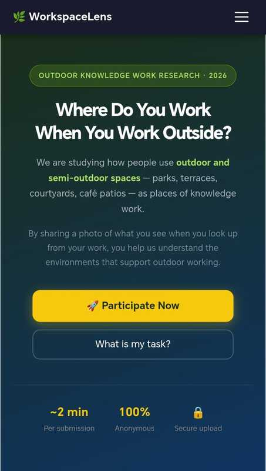
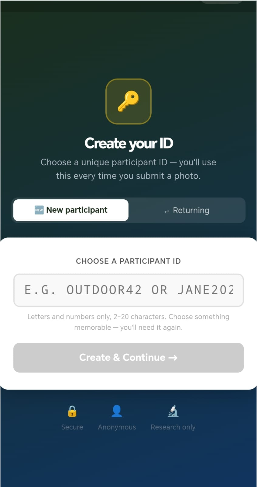
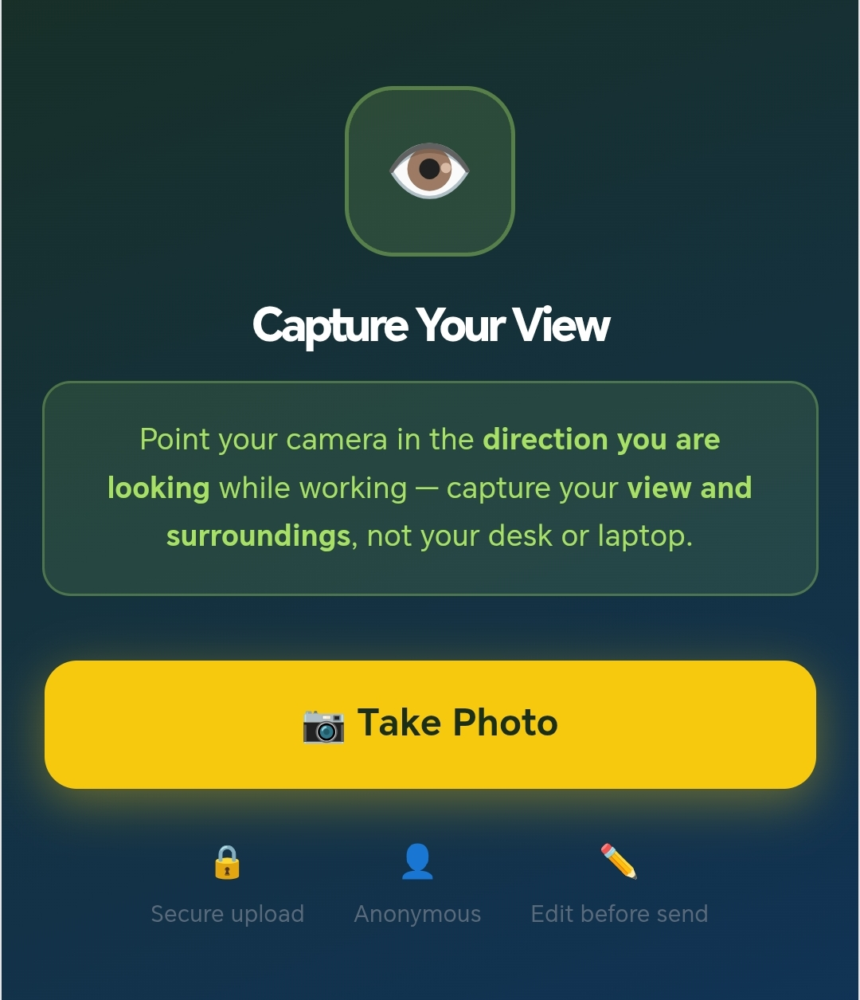
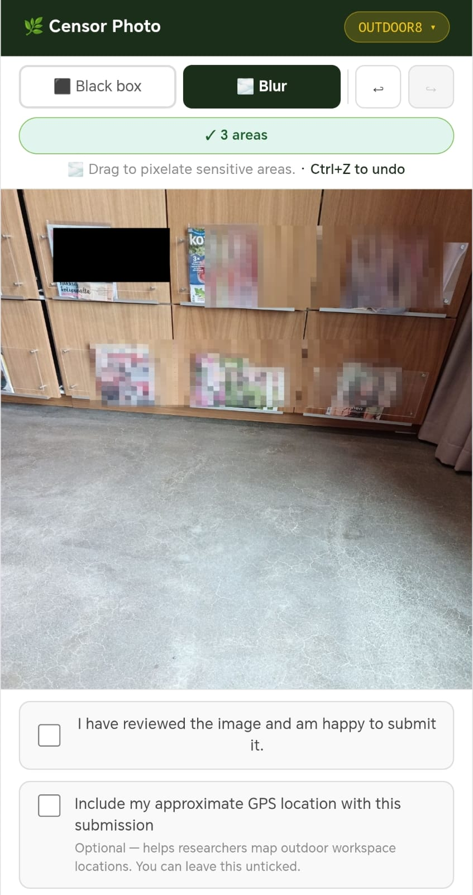
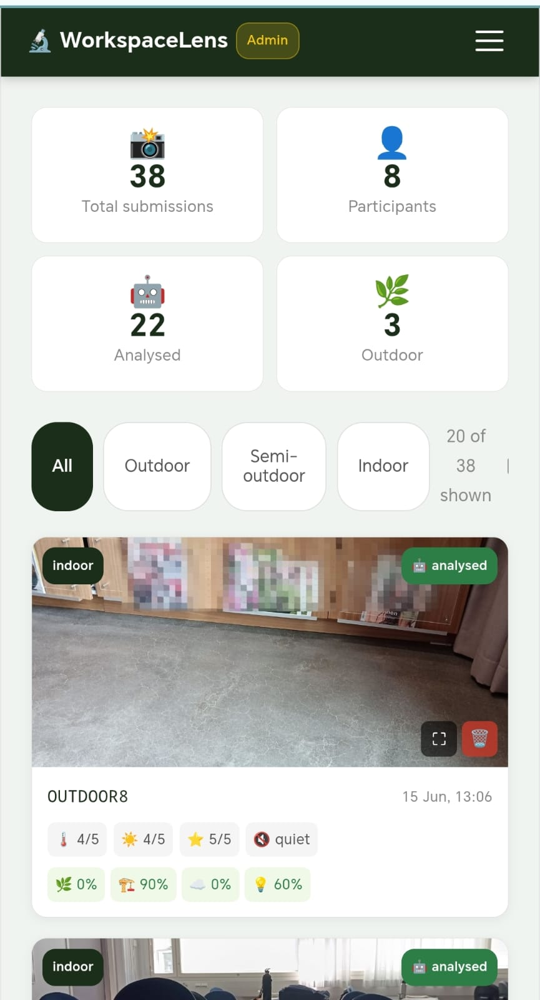
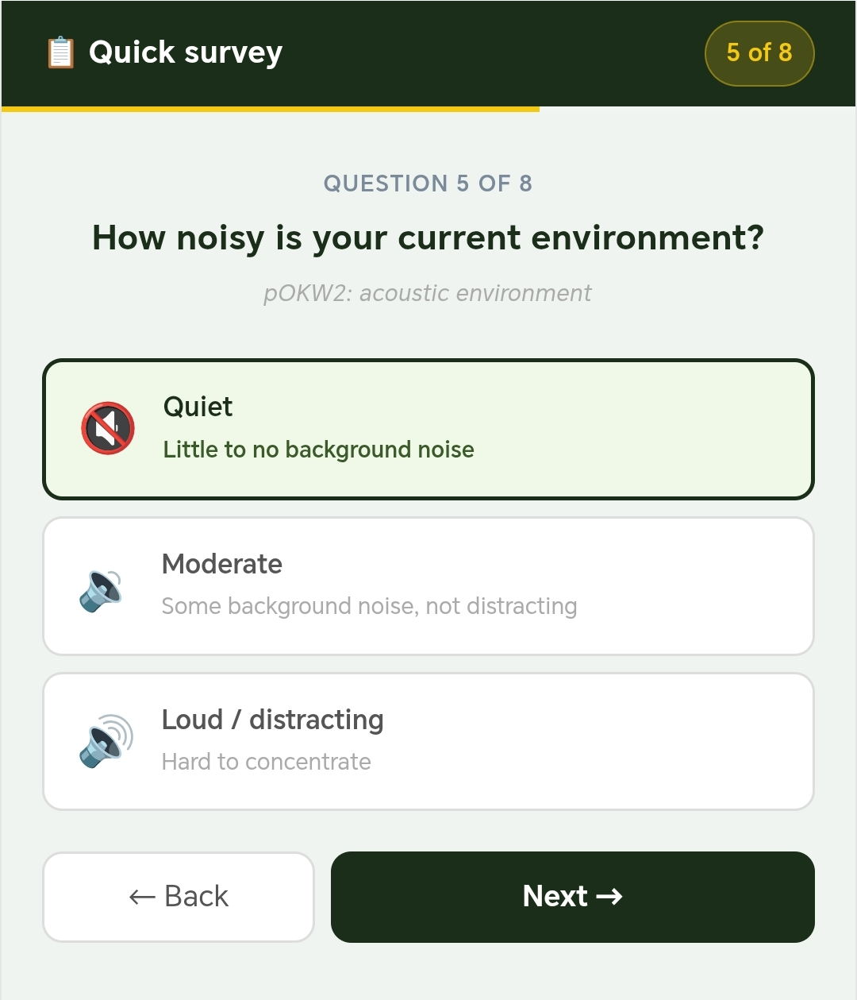
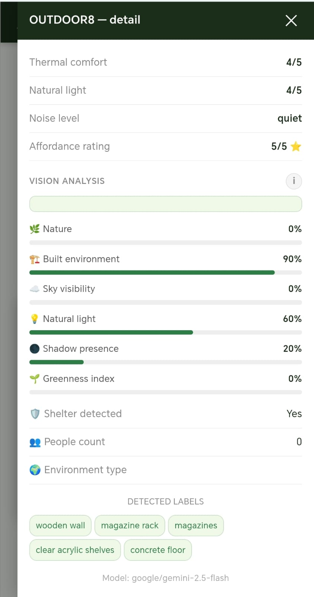

## Project Overview


**Research Unit:** CrowdComputing Research Group, University of Oulu  
**Timeline:** May 2026 – Ongoing  
**Type:** Research Project / Progressive Web App  
**Status:** Pilot study / data collection in progress  
**Main App:** [WorkSpaceLens](https://tinyurl.com/y89w8637)  
**Admin Portal:** [WorkSpaceLens-Admin](https://tinyurl.com/mumu3ey2)



**WorkspaceLens** is a mobile-first Progressive Web Application (PWA) that implements the **pOKW2 photo analysis model** (Herneoja et al., 2023) for collecting and analysing self-reported photographs from outdoor and semi-outdoor knowledge work environments.



Working outdoors is an emerging and sparsely studied phenomenon. Hybrid and remote work have transformed where knowledge workers choose to work be it parks, terraces, courtyards, café patios etc. yet the physical characteristics of these spaces and their effect on productivity remain largely unquantified. WorkspaceLens addresses this gap by providing a structured, privacy-aware, mobile data collection tool aligned to the pOKW2 research methodology.


The application collects gaze-direction photographs (what the participant sees, not their desk), paired with an 8-question Experience Sampling Method (ESM) questionnaire, GPS coordinates, and automated computer vision analysis — all linked by participant ID and timestamp for cross-dataset joining.


---

## Research Background

The project is grounded in the following peer-reviewed work:

- **Herneoja et al. (2023).** *Interdisciplinary approach to defining outdoor places of knowledge work: quantified photo analysis.* Frontiers in Psychology. [DOI: 10.3389/fpsyg.2023.1237069](https://doi.org/10.3389/fpsyg.2023.1237069)
- **TWR Network (2024).** *TWR2024 Proceedings.* Thermally responsive workplace design and semi-outdoor classification framework.
- **ACM (2024).** *Privacy perceptions in photo annotations.* [DOI: 10.1145/3631439](https://dl.acm.org/doi/10.1145/3631439) — informs the privacy editor design and participant responsibility model.

The pOKW2 model defines three layers of data collection:

| Layer | Method | Description |
|-------|---------|-------------|
| **A** | Participant (ESM) | Self-reported survey + photo metadata + GPS |
| **B** | Automated vision | Computer vision scores per pOKW2 category |
| **C** | Researcher | Expert interpretation, spatial design, narrative synthesis |

WorkspaceLens implements Columns A and B in full, with Column C reserved for researcher post-collection analysis.

---

## Key Features

- **Mobile-only PWA** – Installable on iOS (Safari) and Android (Chrome). No app store required. Works offline after first login.

- **Gaze-direction camera** – Participants photograph what they see while working, not their workstation.

- **Privacy editor** – In-browser Canvas tool with black box and pixelation blur to mask sensitive content. with enforced upload gates: minimum file size, optional GPS, and an explicit review checkbox.




- **pOKW2 ESM questionnaire** – 8 mandatory questions: location type, thermal comfort, surroundings (multi-select), natural light, noise level, activity, shelter/wind exposure, and the pOKW2 Additional Question (AQ) affordance rating.

- **GPS capture** – Optional browser Geolocation API, runs in parallel with photo upload. Enables cross-referencing with weather datasets.

- **Offline queue** – Failed uploads saved to localStorage and retried automatically on reconnect. Participants see a queued state rather than an error.

- **Participant ID validation** – IDs pre-registered in Supabase by the researcher. Validated on first login, cached for offline use.

- **iOS Safari guidance** – Detects browser on iPhone and prompts to switch to Safari and add to Home Screen for full PWA functionality.

- **Automated vision analysis** –  Integrates with OpenRouter supported vision models (Gemini, GPT-4o, Llama fallback).

- **Research admin dashboard** – Password-protected `/admin` route. Server-side JWT authentication. Paginated gallery, ESM response viewer, vision score progress bars, detected label tags, and CSV export.



---

## System Architecture

The system follows a three-tier architecture with no custom backend API server required for data collection.

- **Frontend:** React 19 + TypeScript + Vite 8, deployed on Netlify
- **Storage:** Supabase Storage bucket — `{participantId}/{timestamp}.jpg`
- **Database:** Supabase PostgreSQL — `participants`, `submissions`, `photo_analysis`
- **Vision pipeline:** Deno Edge Function → OpenRouter → PostgreSQL
- **Admin auth:** Server-side JWT

---

## ESM Questionnaire — pOKW2 Aligned

The 8-question survey is delivered on device immediately after photo capture:

| Q | Question | pOKW2 mapping |
|---|----------|---------------|
| 1 | Where are you working right now? | Location type classification |
| 2 | Thermal comfort right now? (1–5) | Thermal environment rating |
| 3 | What do you see in front of you? | Denotation-code: surroundings |
| 4 | Natural light level? (1–5) | Light quality assessment |
| 5 | Noise level? | Acoustic environment |
| 6 | Current work activity? | Activity context |
| 7 | Are you sheltered from wind/rain? | Semi-outdoor classification |
| 8 | Does this environment support your work? (1–5) | **pOKW2 AQ — core analytical output** |



---

## Vision Analysis Pipeline

Each submitted photo is automatically analysed by an OpenRouter vision model and scored against pOKW2 categories:

| Score | What is detected |
|-------|-----------------|
| Nature score | Vegetation, greenery, water (0–1) |
| Built environment | Buildings, walls, furniture (0–1) |
| Sky visibility | Open sky ratio (0–1) |
| Natural light score | Light quality and quantity (0–1) |
| Shadow presence | Sun angle indicator (0–1) |
| Shelter detected | Overhead structure (boolean) |
| People count | Visible people (integer) |
| Greenness index | Vegetation pixel ratio (0–1) |

Results are stored in PostgreSQL and displayed in the researcher admin dashboard alongside ESM responses.


---

## Data Privacy & Consent

- No personal data collected — open access for participants with own unique ID
- GPS is strictly opt-in — Optional GPS permission
- Data storage is private — write-only anon access, no public listing
- All data transmitted over HTTPS — TLS enabled
- Full transparency — covers research use, privacy responsibility, and voluntary participation

---

## Data Model

Each participant submission produces:

```json
{
  "participantId": "P001",
  "studyId": "outdoor-work-study-2025",
  "timestamp": "2026-05-17T09:14:22.000Z",
  "gps": { "lat": 65.012, "lng": 25.471, "accuracy": 15 },
  "responses": {
    "locationType": "outdoor",
    "thermalComfort": 4,
    "surroundings": ["nature", "sky"],
    "naturalLight": 5,
    "noiseLevel": "quiet",
    "activity": "deep-focus",
    "shelter": "no",
    "affordanceRating": 5
  }
}
```

All records are linked by `participantId + timestamp`, enabling the researcher to join photo, ESM responses, GPS, and vision scores into a single analysis dataset.

---

## Development Progress

| Version | Milestone | Status |
|---------|-----------|--------|
| v0.1.0 | PWA scaffold, camera, privacy editor | ✅ Done |
| v0.2.0 | User flow, mobile UX polish | ✅ Done |
| v0.3.0 | ESM questionnaire, GPS, PostgreSQL | ✅ Done |
| v0.4.0 | iOS Safari guidance, participant ID validation | ✅ Done |
| v0.5.0 | Vision analysis Edge Function + OpenRouter | ✅ Done |
| v1.0.0 | Admin dashboard, JWT auth, CSV export | ✅ Done |
| v1.1.0 | Pilot study — data collection | 🔄 Planned |

---

## Planned: Pilot Study

<!-- TODO: Update this section once the pilot study is completed -->

A pilot study is planned with **10–20 participants**  by the research team. Interested participants can participate and access with their own created participant ID.

**Study parameters:**
- Collection period: 2–3 weeks
- Target: 3–5 submissions per participant
- Location requirement: outdoor or semi-outdoor workspaces
- Data: JPEG photos + ESM responses + GPS + automated vision scores

<!-- TODO: Add preliminary findings once data collection is complete -->
<!-- TODO: Add participant demographics and location distribution map -->
<!-- TODO: Link to dataset or publication if made available -->

---

## Technologies Used

`React 19` · `TypeScript` · `Vite 8` · `PWA / Workbox` · `Supabase` · `PostgreSQL` · `Deno Edge Functions` · `OpenRouter` · `Netlify` · `HTML Canvas API`

---

## Keywords

`HCI` · `Mobile Computing` · `Experience Sampling Method (ESM)` · `Computer Vision` · `Hybrid Work` · `Knowledge Work` · `Photo Analysis` · `pOKW2` · `Environmental Affordances` · `Outdoor Workspaces` · `Progressive Web App` · `Privacy by Design`

---

## Conclusion

WorkspaceLens demonstrates that a lightweight PWA can implement a rigorous research methodology: the pOKW2 model hence without requiring a native mobile app or complex backend infrastructure. The automated vision analysis pipeline enables scalable quantification of outdoor workspace characteristics, while the privacy editor and consent framework ensure ethical data collection.

The pilot study will validate the data collection pipeline with real participants in real outdoor locations, producing a structured dataset of gaze-direction photographs, ESM survey responses, GPS coordinates, and computer vision scores, that is ready for interdisciplinary analysis combining architectural, environmental psychology, and knowledge work research perspectives.

<!-- TODO: Update conclusion with study outcomes and findings once available -->
